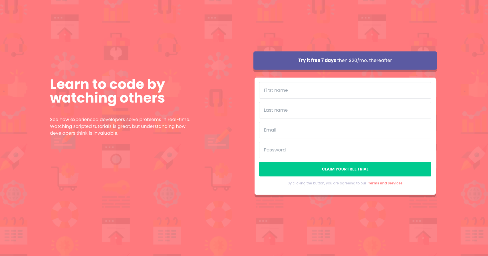
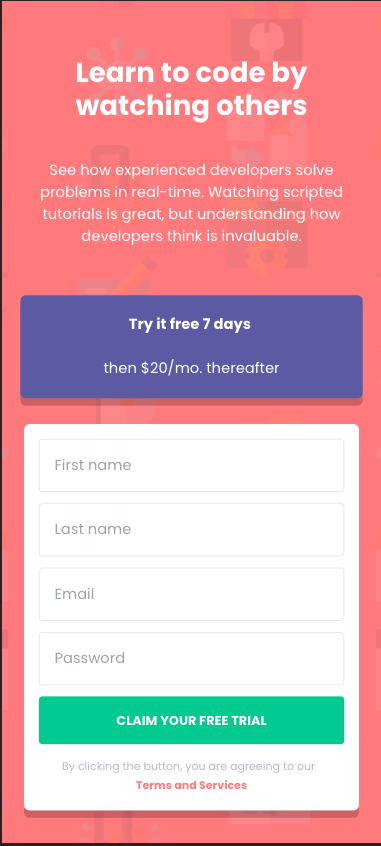
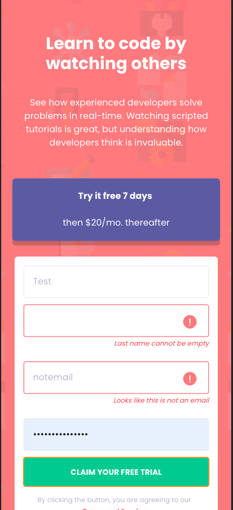

# Frontend Mentor - Intro component with sign up form solution

This is a solution to the [Intro component with sign up form challenge on Frontend Mentor](https://www.frontendmentor.io/challenges/intro-component-with-signup-form-5cf91bd49edda32581d28fd1).

## Table of contents

- [Overview](#overview)
  - [The challenge](#the-challenge)
  - [Screenshot](#screenshot)
  - [Links](#links)
- [My process](#my-process)
  - [Built with](#built-with)
  - [What I learned](#what-i-learned)
  - [Continued development](#continued-development)
  - [Useful resources](#useful-resources)
- [Author](#author)
- [Acknowledgments](#acknowledgments)

## Overview

### The challenge

Users should be able to:

- View the optimal layout for the site depending on their device's screen size
- See hover states for all interactive elements on the page
- Receive an error message when the `form` is submitted if:
  - Any `input` field is empty. The message for this error should say _"[Field Name] cannot be empty"_
  - The email address is not formatted correctly (i.e. a correct email address should have this structure: `name@host.tld`). The message for this error should say _"Looks like this is not an email"_

### Screenshot

### Links

- Solution URL: [https://github.com/R3sty/Intro-component-with-sign-up-form]
- Live Site URL: [https://r3sty.github.io/Intro-component-with-sign-up-form/]

### Built with

- Mobile-first workflow
- [React](https://reactjs.org/) - JS library
- [Styled Components](https://tailwindcss.com//) - For styles

### What I learned

This project was an opportunity for me to improve my skills in web development and learn new technologies. In this project, I gained experience in various areas including deployment, styling, validation, and state management.

# Deployment Through Github Pages

One of the key areas I learned in this project was deployment. I deployed the project using Github Pages, a platform that allows you to host static websites for free. This was a great opportunity for me to learn how to use Github Pages and understand its benefits. I learned how to configure my repository, set up the domain, and deploy my code to the platform.

# TailwindCSS

TailwindCSS is a utility-first CSS framework that I used to style the project. I learned how to use its classes to quickly and efficiently style my components. TailwindCSS has a large collection of pre-designed classes, making it easy to achieve a consistent look and feel for the project.

# Validation

I learned about form validation in this project, which is the process of checking user input to ensure it meets certain criteria. I used JavaScript to validate the user's input and provide error messages if necessary. This was a crucial part of the project as it ensured that the user was entering correct and valid data.

# React Hooks

I used React Hooks in this project, which are functions that allow you to manage state and other react features in functional components. React Hooks provide a simpler and more flexible way of handling state compared to class components. I learned how to use the useState, useEffect, and useRef hooks to manage my component's state.

# Responsive Design

I also learned about responsive design, which involves creating a layout that adjusts to different screen sizes. This is important because it ensures that your website is accessible on different devices and looks good on different screen sizes. I used CSS media queries to create a responsive design for the project.

# ChatGPT

Lastly, I learned how to maximize the use of OpenAI's Chatgpt to help me build my project faster. I utilized Chatgpt's ability to generate code snippets and provide answers to my questions, which allowed me to complete my project in a shorter amount of time. This also helped me to improve my understanding of the technologies I was using and to learn from Chatgpt's experience.

In conclusion, building this project was a great learning experience for me. I learned how to deploy a website, style it using TailwindCSS, validate user input, manage state using React Hooks, create a responsive design, and maximize the use of OpenAI's Chatgpt. I am confident that these skills will help me in future projects and I am excited to continue learning and growing as a web developer.

### Useful resources

- [TailwindCSS Documentation](https://tailwindcss.com/docs/installation/) - This helped me for XYZ reason. I really liked this pattern and will use it going forward.

## Author

- Website - [Resty Iral](https://www.restyiral.com/)
